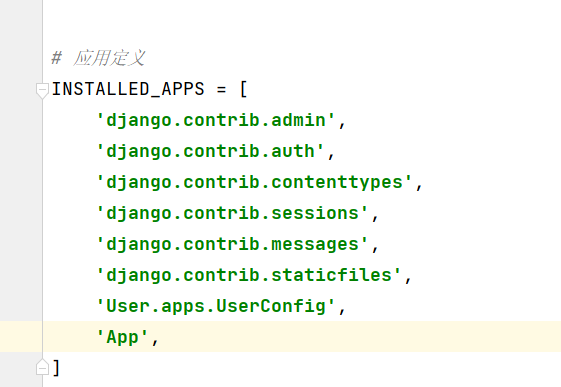

# Django

## 1 . 目录结构
- manage.py
    - 管理本项目的命令行工具，在站点运行、数据库自动生成都是通过本文本完成
- __ init__.py
    - 告诉python该目录是一个python包，工具初始化可能会用到
- settings.py
    - Django项目配置文件，默认状态其中定义了本项目引用的组件、项目名、数据库、静态资源
- urls.py
    - 维护项目的URL路由映射
- wsgi.py
    - Python Web Server GateWay Interface , 即Python服务器网关接口，是Python应用于Web服务器之间的接口，用于Django项目在服务器的部署和上线
- asgi.py
    - 定时ASGI的接口信息，于WSGI类似，ASGI实现了异步处理，用于起步异步通信服务

## 2.目录文件详解
- settings.py
```python
from pathlib import Path

# 项目根目录
#.parent.parent == ../../ 
BASE_DIR = Path(__file__).resolve().parent.parent  


# Quick-start development settings - unsuitable for production
# See https://docs.djangoproject.com/en/4.2/howto/deployment/checklist/

# SECURITY WARNING: keep the secret key used in production secret!
SECRET_KEY = 'django-insecure-7il*gbpz8a3=nf(c8k5z8*b(sqpag_928tm-uubf)w%!wy9gkn'

# 是否使用调试模式
#开发：True
#上线：False
DEBUG = True

#被允许的ip
#  '*' ：匹配所有的ip
ALLOWED_HOSTS = ['*']


# 应用定义
INSTALLED_APPS = [
    'django.contrib.admin',
    'django.contrib.auth',
    'django.contrib.contenttypes',
    'django.contrib.sessions',
    'django.contrib.messages',
    'django.contrib.staticfiles',
    'User.apps.UserConfig',
]


#中间件
MIDDLEWARE = [
    'django.middleware.security.SecurityMiddleware',
    'django.contrib.sessions.middleware.SessionMiddleware',
    'django.middleware.common.CommonMiddleware',
    'django.middleware.csrf.CsrfViewMiddleware',
    'django.contrib.auth.middleware.AuthenticationMiddleware',
    'django.contrib.messages.middleware.MessageMiddleware',
    'django.middleware.clickjacking.XFrameOptionsMiddleware',
]

#指定根路由
ROOT_URLCONF = 'djangoProject.urls'

#模板
TEMPLATES = [
    {
        'BACKEND': 'django.template.backends.django.DjangoTemplates',
        'DIRS': [BASE_DIR / 'templates']
        ,
        'APP_DIRS': True,
        'OPTIONS': {
            'context_processors': [
                'django.template.context_processors.debug',
                'django.template.context_processors.request',
                'django.contrib.auth.context_processors.auth',
                'django.contrib.messages.context_processors.messages',
            ],
        },
    },
]


WSGI_APPLICATION = 'djangoProject.wsgi.application'


# Database

DATABASES = {
    'default': {
        'ENGINE': 'django.db.backends.sqlite3',
        'NAME': BASE_DIR / 'db.sqlite3',
    }
}


#密码验证

AUTH_PASSWORD_VALIDATORS = [
    {
        'NAME': 'django.contrib.auth.password_validation.UserAttributeSimilarityValidator',
    },
    {
        'NAME': 'django.contrib.auth.password_validation.MinimumLengthValidator',
    },
    {
        'NAME': 'django.contrib.auth.password_validation.CommonPasswordValidator',
    },
    {
        'NAME': 'django.contrib.auth.password_validation.NumericPasswordValidator',
    },
]


# 国际化通配（Language&Region）

LANGUAGE_CODE = 'en-us' #zh-hans

TIME_ZONE = 'UTC'

USE_I18N = True

USE_TZ = True


# Static files (CSS, JavaScript, Images)
# https://docs.djangoproject.com/en/4.2/howto/static-files/

#静态文件
STATIC_URL = 'static/'

# Default primary key field type
# https://docs.djangoproject.com/en/4.2/ref/settings/#default-auto-field

DEFAULT_AUTO_FIELD = 'django.db.models.BigAutoField'
```

## 3. 运行起来
- 执行`python .\manager.py runserver` 运行Django
  - 指定端口和ip地址（也可单独）`python .\manager.py runserver 0.0.0.0：8001`

## 4. 数据迁移
>将模型映射到数据库
- 生成迁移文件: `python manage.py makemigrations`
  - 执行时可能会报错
    - >ImportError: Couldn't import Django. Are you sure it's installed and available on your PYTHONPATH environment variable? Did you forget to activate a virtual environment?
    - 解决方法 `pip install django`,然后依据提示添加环境变量
        >  **WARNING**: The script sqlformat.exe is installed in            '                    **`'C:\Users\22450\AppData\Roaming\Python\Python39\Scripts'`** which is not on PATH.
        Consider adding this directory to PATH or, if you prefer to suppress this warning, use --no-warn-script-location.
        **WARNING**: The script django-admin.exe is installed in **`'C:\Users\22450\AppData\Roaming\Python\Python39\Scripts'`** which is not on PATH.
        Consider adding this directory to PATH or, if you prefer to suppress this warning, use --no-warn-script-location.

- 执行迁移: `python manage.py migrate`

## 5. 创建应用
- 命令 `python manage.py startapp <APPNAME>`
- 使用应用前需要将应用配置到项目中，再setting.py中将应用加入到INSTALLED_APPS选项中

- 应用目录介绍
  - __init __.py
    - 暂无内容，使app成为一个包
  - admin.py
    - 管理站点模型的声明文件，默认为空
  - apps.py
    - 应用信息定义文件，在其中生成了AppConfig，定义了应用名等数据
  - models.py
    - 添加模型层数据类文件
  - views.py
    - 定义URL相应函数，视图函数
  - migrations包
    - 自动生成迁移文件包
  - tests.py
    - 测试文件