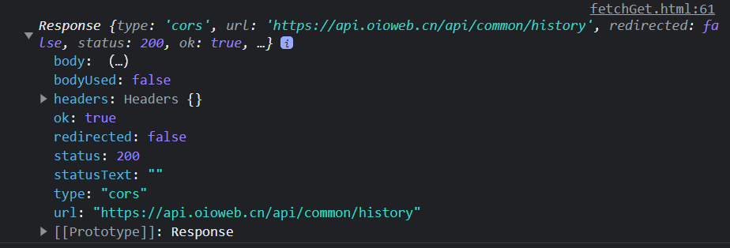
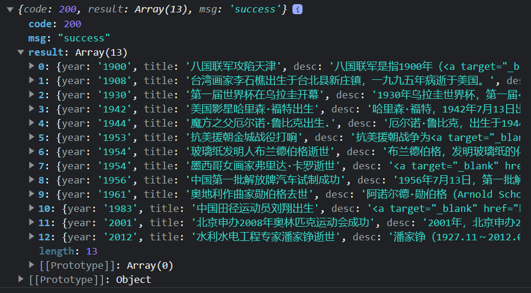

#Fetch
> 下一代Ajax技术。采用Promise方式来处理数据直接用`.then()`即可
> API分散于多个对象（**Response对象**，**Request对象**，**Header对象**） 
> 通过stream处理数据，大文件或者网速慢非常友好

>学习资料推荐
https://developer.mozilla.org/zh-CN/docs/Web/API/Fetch_API  -官方文档
https://www.ruanyifeng.com/blog/2020/12/fetch-tutorial.html -阮一峰的博客


## 1. 概念
- Fetch 提供了对 `Request` 和 `Response`（以及其他与网络请求有关的）对象的通用定义。它同时还为有关联性的概念，例如 CORS 和 HTTP Origin 标头信息，提供一种新的定义，取代它们原来那种分离的定义。
- Fetch() **强制**接受一个参数，即要获取的资源的路径。它**返回一个 Promise**，该 Promise 会在服务器使用**标头响应后**，兑现为该请求的 `Response`——即使服务器的响应是 `HTTP 错误状态`。你也可以传一个可选的第二个参数 init（参见 Request）。

## 2. GET请求
- 发送get请求
    `fetch()`只接收一个URL字符串作为参数，默认向该网址发出 GET 请求，返回一个 Promise 对象。它的基本用法如下。
    ```js
    fetch(url)
    .then(...)
    .catch(...)
    ```
    - 下面是一个请求的示例:arrow_down:
    ```js
    fetch('https://api.oioweb.cn/api/common/history')
    .then(res => {
            console.log(res)
        })
        .catch(e => {
            console.error(e)
        })
    ```
    >此时得到的是一个Response实例对象，并不能获取到返回的数据
    
    - 需要通过res.json的异步方法获取数据
    ```js
        fetch('https://api.oioweb.cn/api/common/history')
        .then(res => {
            return res.json()
        }).then(json => {
            console.log(json)
        })
        .catch(e => {
            console.error(e)
        })
    ```
    

    >使用async、await对代码进行改写如下:arrow_down:
    ```js
        async function getData() {
        try {
            //获取Response对象
            let res = await fetch('https://api.oioweb.cn/api/common/history')

            //通过res.json取出结果
            let json = await res.json();
            console.log(json)
            } catch (e) {
                console.error(e)
            }
        }
        getData()
    ```
    - GET 方法传参方式可以通过URL
    ```js
        async function getData() {
            try {
                //获取Response对象
                let res = await fetch('https://localhost:3000/post?id=2')
                    //通过res.json取出结果
                let json = await res.json();
                console.log(json)
            } catch (e) {
                console.error(e)
            }
        }
        getData()
    ```
## 3. Response对象 处理HTTP回应
>Response 通过Stream接口异步读取，但是并不是仅仅有异步属性，其还包含了一定的同步属性
- 同步属性
  - url 
  - type    `返回请求类型`
  - status  `(int)请求是否成功，404，200`
  - stutusText  `返回状态文本信息`
  - ok  `(bool)请求是否成功`
  - redirect    `（bool）是否发生过跳转`
```js
    try {
        async function getData() {
            let res = await fetch('http://localhost:3000/posts')
            console.log(res);
            console.log(res.ok); //(bool)请求是否成功
            console.log(res.status); //(int)请求是否成功，404，200
            console.log(res.statusText); //返回状态文本信息
            console.log(res.url);
            console.log(res.type); //返回请求类型
            console.log(res.redirected); //（bool）是否发生过跳转
            let json = await res.json();
            console.log(json)
        }
        getData()
    } catch (e) {
        console.error(e)
    }
```
## 4. fetch配置参数
>fetch第一个参数是url，第二个参数可以作为配置对象，自定义发出HTTP请求。

- `fetch(url,config)`，仅有url参数时默认时`get`请求，如果需要其他请求类型，则需要在`config`中进行配置
  - config参数可以解构如下
    ```js
    let config = {
            method: 'POST',
            headers: {
                'Content-Type': 'application/json'
            },
            body: JSON.stringify(obj)
        }
    ```
    其中`obj`对象为需要传递的自定义对象，而且要将起序列化之后才合法
    ```js
    let obj = {
            title: 'config',
            author: 'proleage'
        }
    ```
    `url`就传入服务器地址
    `let url = 'http://localhost:3000/posts'`
    完成函数的初始化之后便可以开始异步调用
    ` let res = await fetch(url, config)`
    返回的时一个Response对象，不是我们所需要的最终对象，所以再一次执行一次异步操作，获得我们需要的内容
    `let json = await res.json()`
    最后打印出来
    `console.log(json)`
    >你可以将上面的代码封装到一个方法中，每次需要的时候调用即可

    >如果你的console.log()内容，在浏览器控制台中一闪而过，是由于vscode的LiveServer，每次执行完Post都会进行刷新操作，关闭LiveServer即可

-------------------------------------------
## 5. fetch函数封装
>经过上面的学习很难不让人觉得fetch()的请求体过于冗长 ，在使用的过程中多有不便，下面就开始对http（）进行封装，简化每次的操作
- 理想的效果是通过这样的方式完成GET请求
    ```js
    let res = await http({
            method: 'GET',
            url: 'http://localhost:3000/posts',
            params: {
                id: 3
            },
        })
    ```
    或者是这样完成POST请求
    ```js
    let res = await http({
            method: "POST",
            url: 'http://localhost:3000/posts',
            data: {
                title: "package",
                author: "Gound"
            }
        })
    ```
    则对于`http()`函数应该这样封装
    ```js
     async function http(obj) {
        let {
            method,
            url,
            params,
            data
        } = obj;
        //params需要转换成key1=value1&key2=value2，然后拼接好url
        //固定写法
        if (params) {
            let str = new URLSearchParams(params).toString()
                //拼接url,别忘记问号
            url = url + '?' + str
        }

    ```

