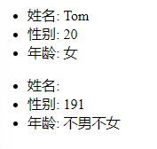
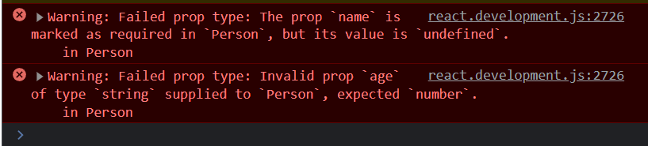

#React
>脚手架快速引入项目
> - 安装要求：Node>=8.10 并且 npm>=5.6

    建议：Node>=10.14.2，否则会报错：
    error babel-jest@26.6.3: The engine "node" is incompatible with this module. 
    Expected version ">= 10.14.2". Got "10.13.0"

> - 安装create-react-app
    `npm install -g create-react-app `
> - 检查是否安装成功
`create-react-app -V`
> - 创建react项目

    npx create-react-app <appName>
    cd appName
    npm start

## 1. cdn引入helloworld case
    1. 准备html结构
    2. 引入准备好react依赖文件
    3. 准备好容器
    4. 引入依赖文件（必须有序）
    5. 在bable中操作
- jsx实现虚拟DOM
```html
    <body>
        <div id="test"></div>
        //顺序
        <script type="text/javascript" src="../js/react.development.js"></script>
        <script type="text/javascript" src="../js/react-dom.development.js"></script>
        <script type="text/javascript" src="../js/babel.min.js"></script>
        //bable不能少
        <script type="text/babel">
            //创建虚拟DOM
            const VDOM =
            <h1>Hello,React</h1>
            //渲染虚拟DOM到页面
            ReactDOM.render(VDOM,document.getElementById('test'))
        </script>

    </body>
```
- js实现DOM

```html
    <body>
        <div id="test"></div>
        <script type="text/javascript" src="../js/react.development.js"></script>
        <script type="text/javascript" src="../js/react-dom.development.js"></script>

        <script type="text/javascript">
            //创建虚拟DOM
            const VDOM = React.createElement('h1', {
                id: 'title'
            }, 'Hello,React(JS)');
            ReactDOM.render(VDOM, document.getElementById('test'))
        </script>
    </body>
```
>看着似乎更简单，可是如果要求内容体包含在 &#60;span> 标签中,使用JS编写将是这样
```js
const VDOM = React.createElement('h1',{id:'title'},React.createElement('span',{},'Hello,React'))
```
非常繁琐，而使用jsx编写则非常简洁，如下
```js
const VDOM =<h1><span>Hello,React</span></h1>
```

## 2. JSX语法
- 定义虚拟DOM，不要写引号

   ```html 
    const VDOM = <h1> Hello,React </h1>
   ```
- 标签有`js表达式`要用{} ,**注意不是`js语句`**

    ```html
    const VDOM = (
        <h2 id={myId.toLowerCase()}>
            <span>{myData.toLowerCase()}</span>
        </h2>
    );
    ```
- 样式类名指定要用`className=''`,不要用 `class`

```html
    <h2 className='title' id={myId.toLowerCase()}>
        <span>{myData.toLowerCase()}</span>
    </h2>)
```

- 内联样式，要用style={{key:value}}形式去写，注意要用驼峰格式

```html
<span style={{color: 'white',fontSize: '50px'}}>{myData.toLowerCase()}</span>
```
- 只有一个根标签（id不能相同）
- 标签的首字母

    - 若为小写字母开头，则转换为html中同名元素，如果该标签在html中不存在，报错
    -  若为大写字母开头，则react去渲染对应的组件，如果没有定义该组件，报错

-  jsx中只能遍历数组，不能遍历对象

    ```html 
    <script type="text/babel">
        const data = ['Angular','React','Vue'] ;
        const VDOM = (
            <div>
                <h1>前端js框架列表</h1>
                <ul>
                    { 
                        data.map((item,index) => { 
                            return(<li key={index}>{item}</li>); 
                        }) 
                    }
                </ul>
            </div>
        ); 
        ReactDOM.render(VDOM,document.getElementById('test'));
    </script>
    ```
            注意{}内只能是表达式，不能是js语句，而且index作为key仍然不是最好的解决方法，
            在后续的文本中会解释该问题


# 2. React面向组件编程 
## 2.1.1 使用React开发者工具调试

- **Chrome://extensions**  `React Developer Tools`

## 2.1.2 类型
- 函数式组件（简单组件）
    ```html
    <body>
        <div id='test'></div>
        <script type="text/javascript" src="../js/react.development.js">
        </script>
        <script type="text/javascript" src="../js/react-dom.development.js">
        </script>
        <script type="text/javascript" src="../js/babel.min.js">
        </script>
        <script type="text/babel">
            //创建函数式组件
            function Demo(){ 
                return (<h2>使用函数定义的组件</h2>) } 
            ReactDOM.render(<Demo/>,
            //渲染组件到页面
            document.getElementById('test'))

            /*      
            */
        </script>
    </body>
    ```
    执行ReactDOM.render(<Demo/>,document.getElementById('text'))后发生了什么
                1. React解析组件标签，找到Demo函数
                2. 发现组件是函数定义的，调用该函数，将虚拟DOM转化为真实DOM   
    >注意：函数名应该大写，标签名也要大写，小写会自动匹配html标签
    >如果尝试console.log(this),输出为`undefined`，是由于babel编译之后开启了严格模式，限制自定义函数中的this指向window
- 类式组件 （复杂组件）

> 关于类的补充知识
>>1.constructor不是必写的，传参才写
>>2.涉及到继承的时候，js中采用原型链（Prototype）查找继承的
>>3.如果 Class B extends A ,B中有Constructor，则B类构造器中的super是必须调用的。

```js
    class B{
        constructor(a,b){
            this.a=a;
            this.b=b;
        }
    }
    class A extends B{
        constructor(a,b,c){
            super(a,b);
            this.c =c 
        }   
    }
```

- 类式组件的相依代码
    ```html
    <body>
        <div id='test'></div>
        <script type="text/javascript" src="../js/react.development.js">
        </script>
        <script type="text/javascript" src="../js/react-dom.development.js">
        </script>
        <script type="text/javascript" src="../js/babel.min.js">
        </script>
        <script type="text/babel">
            //创建类式组件
            class MyComponent extends React.Component{ 
                render() { //此render非彼render

                    return (<h2>我是类式组件</h2>) } } 
            //渲染到页面
            ReactDOM.render(
            <MyComponent/>,document.getElementById('test'))
        </script>
    </body>
    ```

    执行ReactDOM.render(<MyComponent/>,document.getElementById('test')),发生了什么
        1. React解析组件，找到MyComponent组件
        2. 发现是类定义的，则new该对象的实例，并通过实例调用到圆形的render()
        3. 将render()转换成真实DOM，渲染在页面上

## 2.2 组件实例的三大核心属性状态（state）
> 组件的状态驱动页面改变

### 2.2.1 效果

- 简单组件（无状态）
- 复杂组件（有状态）[这是效果](/upload/react/helloworld/hello/react的state.html)
    ```html
    <body>
        <div id='test'></div>
        <script type="text/javascript" src="../js/react.development.js">
        </script>
        <script type="text/javascript" src="../js/react-dom.development.js">
        </script>
        <script type="text/javascript" src="../js/babel.min.js">
        </script>
        <script type="text/babel">
            class Weather extends React.Component{ 
                constructor(props){ 
                    super(props)
                    this.state={isHot:false,wind:'台风'} 
                    //解决changeWeather中this的只想问题
                    this.changeWeather = this.changeWeather.bind(this)
                    } 
                    //调用1+n次，视图一变就开始调用
                    render(){
                        console.log(this);
                        return (
                        <h1 onClick={this.changeWeather}>今天天气很{this.state.isHot ? '热':'冷'},今天有{this.state.wind}</h1>
                        ) 
                    }

                    //changeWeather在原型对象上，供实例调用
                    //changeWeather是onClick的回调函数，不是通过实例调用的
                    //类中的方法默认开启局部严格模式，所以changeWeatherd 的 this调用为undefined
                    changeWeather(){ 
                        //状态不能直接更改需要借助setState(),更新是合并
                        const isHot = this.state.isHot;
                        //this.state.isHot = !isHot  错误
                        this.setState({isHot:!isHot})
                    } 

                } 
            ReactDOM.render(<Weather/>,document.getElementById('test')); 
        </script>
    </body>
    ```
    点击title自动调用`demo()`方法自动切换state，
    同时通过`this.state.isHot ? '热':'冷'`,更改显示内容
    >注意：
    > - 调用demo是这样的格式 `<h1 onClick={demo}>`，onClick（）而不是onclick
    >  - `this.changeWeather = this.changeWeather.bind(this)`改成`this.asd = this.changeWeather.bind(this)`,则`<h1 onClick={this.changeWeather}>`改为`<h1 onClick={this.asd}>`

可简写如下
 ```html
    <script type="text/babel">
        class Weather extends React.Component{ 
            state ={isHot:false,wind:'brezee'}; 
            constructor(props){ 
                super(props); 
                } 
            render(){
                const {isHot,wind}=this.state ; 
                return (<h1 onClick={this.changeWeather}>今天的天气很{isHot?'热':'冷'},风很{wind}</h1>
                )}
            changeWeather=()=>{ 
                    const isHot = this.state.isHot; 
                    this.setState({isHot:!isHot})
            }
        } 
        ReactDOM.render(<Weather/>,document.getElementById('test'));
    </script> 
 ```
### 2.2.2理解
    - state是组件的最重要属性，值是对象（可以包含多个k-v键值对）
    - 组件被称为状态机，通过更新组件的state更新对应页面的展示（重新渲染组件）


## 2.3 组件核心属性props

### 2.3.1 效果
>需求：自定义显示一个人员信息的组件
>> 姓名 必须指定，str
>>性别 没有指定默认为男 ，str
>>年龄必须指定， num

### 2.3.2 实现
- 未进行输入控制的代码
```html
<body>
    <div id='test'></div>
    <div id='test2'></div>
    <script type="text/javascript" src="../js/react.development.js">
    </script>
    <script type="text/javascript" src="../js/react-dom.development.js">
    </script>
    <script type="text/javascript" src="../js/babel.min.js">
    </script>
    <script type="text/babel">
        class Person extends React.Component{ render(){ return (
        <ul>
            <li>姓名: {this.props.name}</li>
            <li>性别: {this.props.age+1}</li>
            <li>年龄: {this.props.sex}</li>
        </ul>
        ) } } ReactDOM.render(

        <Person name="Tom" age={19} sex="女" />,document.getElementById('test')); ReactDOM.render(

        <Person name="Tom" age="19" sex="女" />,document.getElementById('test2'));
    </script>
</body>
```
>注意输出结果，对于num类型的引入,采用{number}


- 进行输入控制之后的代码

```html
<body>
    <div id='test'></div>
    <div id='test2'></div>
    <script type="text/javascript" src="../js/react.development.js">
    </script>
    <script type="text/javascript" src="../js/react-dom.development.js">
    </script>
    <script type="text/javascript" src="../js/babel.min.js">
    </script>
    <script type="text/javascript" src="../js/prop-types.js">
    </script>
    <script type="text/babel">
        class Person extends React.Component{ 
            render(){ 
                return (
                    <ul>
                        <li>姓名: {this.props.name}</li>
                        <li>性别: {this.props.age+1}</li>
                        <li>年龄: {this.props.sex}</li>
                    </ul>
                ) 
            } 
        } 

        //输入控制
        Person.propTypes = { 
            name:PropTypes.string.isRequired, 
            age:PropTypes.number, 
            sex:PropTypes.string, 
        }; 
        //设置默认值
        Person.defaultProps={
            sex:'不男不女',
            age:18
        };
        ReactDOM.render(
        <Person name="Tom" age={19} sex="女" />,document.getElementById('test')); 
        ReactDOM.render(
        <Person age='19' />,document.getElementById('test2'));
    </script>
</body>
```
>注意，进行输入控制必须引入这个包
`<script type="text/javascript" src="../js/prop-types.js">`

>输出如图

>不符合要求的提示报错如下


- 可简写如下

```html
<body>
    <div id='test'></div>
    <div id='test2'></div>
    <script type="text/javascript" src="../js/react.development.js">
    </script>
    <script type="text/javascript" src="../js/react-dom.development.js">
    </script>
    <script type="text/javascript" src="../js/babel.min.js">
    </script>
    <script type="text/javascript" src="../js/prop-types.js">
    </script>
    <script type="text/babel">
        class Person extends React.Component{ 
            render(){ 
                return (
                    <ul>
                        <li>姓名: {this.props.name}</li>
                        <li>性别: {this.props.age+1}</li>
                        <li>年龄: {this.props.sex}</li>
                    </ul>
                ) 
            }
            //输入控制
            static propTypes = { 
                name:PropTypes.string.isRequired, 
                age:PropTypes.number, 
                sex:PropTypes.string, 
            }; 
            //设置默认值
            static defaultProps={
                sex:'不男不女',
                age:18
            }; 
        } 

        
        ReactDOM.render(
        <Person name="Tom" age={19} sex="女" />,document.getElementById('test')); 
        ReactDOM.render(
        <Person age='19' />,document.getElementById('test2'));
    </script>
</body>
```

### 2.3.3 函数式组件的使用+输入控制

```html
<body>
    <div id='test'></div>
    <script type="text/javascript" src="../js/react.development.js">
    </script>
    <script type="text/javascript" src="../js/react-dom.development.js">
    </script>
    <script type="text/javascript" src="../js/babel.min.js">
    </script>
    <script type="text/javascript" src="../js/prop-types.js">
    </script>
    <script type="text/babel">
        function Person(props){
            const {name,age,sex}=props;
            return (
                <ul>
                    <li>姓名: {name}</li>
                    <li>性别: {age+1}</li>
                    <li>年龄: {sex}</li>
                </ul>
            )
        }
         //输入控制
        Person.propTypes = { 
            name:PropTypes.string.isRequired, 
            age:PropTypes.number, 
            sex:PropTypes.string, 
        }; 
        //设置默认值
        Person.defaultProps={
            sex:'不男不女',
            age:18
        };
        ReactDOM.render(<Person name="Sandy" age={27} sex="Female"/>,document.getElementById('test'));
    </script>
</body>
```

## 2.4 组件的核心属性 refs

### 2.4.1 效果
>需求：自定义组件，功能说明如下
> - 点击按钮，提示第一个输入框的值
> - 当第二个输入框数去焦点，提示本输入框的值
>

### 2.4.2 理解
 组件内的标签可以定义`ref`属性标识自己
### 2.4.3 实现

- String 类型的ref ：过时且可能会被移除，效率差
    ```html
    <body>
        <div id='test'></div>
        <script type="text/javascript" src="../js/react.development.js">
        </script>
        <script type="text/javascript" src="../js/react-dom.development.js">
        </script>
        <script type="text/javascript" src="../js/babel.min.js">
        </script>
        <script type="text/babel">
            class Demo extends React.Component{
                render(){
                    return (
                        <div>
                            <input ref="input1" type="text" placeholder="点击按钮提示数据"/>
                            <button ref="button1" onClick={this.showData}>点我提示左侧的数据</button>
                            <input ref="input2" type="text"placeholder="失去焦点·提示数据"/>
                        </div>
                    )
                }
                showData = ()=>{
                    const {input1} = this.refs;
                    alert(input1.value)
                }
            }

            ReactDOM.render(<Demo/>,document.getElementById('test'));
        </script>
    </body>

    ```
- 回调函数形式的ref
    ```html
    <body>
        <div id='test'></div>
        <script type="text/javascript" src="../js/react.development.js">
        </script>
        <script type="text/javascript" src="../js/react-dom.development.js">
        </script>
        <script type="text/javascript" src="../js/babel.min.js">
        </script>
        <script type="text/babel">
            class Demo extends React.Component{
                render(){
                    return (
                        <div>
                            <input ref={(currentNode)=>{this.input1 = currentNode}} type="text" placeholder="点击按钮提示数据"/>
                            <button ref={()=>{}} onClick={this.showData}>点我提示左侧的数据</button>
                            <input ref={ currentNode => this.input2 = currentNode } onBlur={this.showData2} type="text"placeholder="失去焦点·提示数据"/>
                        </div>
                    )
                }
                showData = ()=>{
                    const {input1} = this;
                    alert(input1.value)
                };
                showData2 = ()=>{
                    const {input2} = this;
                    alert(input2.value)
                }
            }

            ReactDOM.render(<Demo/>,document.getElementById('test'));
        </script>
    </body>

    ```
- createRef()函数

```html
<body>
    <div id='test'></div>
    <script type="text/javascript" src="../js/react.development.js">
    </script>
    <script type="text/javascript" src="../js/react-dom.development.js">
    </script>
    <script type="text/javascript" src="../js/babel.min.js">
    </script>
    <script type="text/babel">
        class Demo extends React.Component{ 
            //React.createRef调用后返回一个容器，该容器存储被ref标识的节点，专用
            myRef = React.createRef(); 
            myRef2 = React.createRef(); 
            showData = ()=>{ 
                alert(this.myRef.current.value)
                } ;
            showData2 =()=>{
                alert(this.myRef2.current.value)
            };
            render(){ return(
                <div>
                    <input ref={this.myRef} type="text" placeholder="点击按钮提示数据"/>
                    <button onClick={this.showData}>点击提示数据</button>
                    <input onBlur={this.showData2} ref={this.myRef2} type="text" placeholder="失去焦点 提示数据"/>
                </div>
                ) 
            } 
        } 
        ReactDOM.render(<Demo/>,document.getElementById('test'));
    </script>
</body>

```

### 2.4.4 React中的数据处理
- 通过onXyy属性指定事件处理函数（注意大小写）
  - a. React使用的是自定义（合成）事件 ，而非原生DOM事件 `兼容性好`
  - b. React中的事件是通过委托方式处理的(委托给组件最外层元素)  `高效` 

        onClick和onBlur都给了<div>去操作（事件冒泡）
- 减少使用ref的频率

>发生事件的元素是要被操作的元素就可以省略ref
>>如第二个 &#60;input>可以不使用ref,在调用showData2的时候默认会传入一个event参数，包含了&#60;input>内部元素
>>而第一个&#60;input>不能省掉ref是因为需要被&#60;button>出发，传入的event不包含外部的第一个&#60;input>的元素


```html
    <body>
        <div id='test'></div>
        <script type="text/javascript" src="../js/react.development.js">
        </script>
        <script type="text/javascript" src="../js/react-dom.development.js">
        </script>
        <script type="text/javascript" src="../js/babel.min.js">
        </script>
        <script type="text/babel">
            class Demo extends React.Component{ 
                //React.createRef调用后返回一个容器，该容器存储被ref标识的节点，专用
                myRef = React.createRef(); 
                myRef2 = React.createRef(); 
                showData = ()=>{ 
                    alert(this.myRef.current.value)
                    } ;
                showData2 =(event)=>{
                    alert(event.target.value)
                };
                render(){ return(
                    <div>
                        <input ref={this.myRef} type="text" placeholder="点击按钮提示数据"/>
                        <button onClick={this.showData}>点击提示数据</button>
                        <input onBlur={this.showData2}  type="text" placeholder="失去焦点 提示数据"/>
                    </div>
                    ) 
                } 
            } 
            ReactDOM.render(<Demo/>,document.getElementById('test'));
        </script>
    </body>
```
## 2.5 收集表单数据
### 2.5.1 效果
>需求:定义一个包含表单的组件
>>输入用户名密码后，点击登陆提示输入信息

### 2.5.2 理解
包含表单的组件分类
- 受控组件
- 非受控组件

### 2.5.3 实现
- 非受控组件（现用现取，使用Ref）
```html
<body>
    <div id='test'></div>
    <script type="text/javascript" src="../js/react.development.js">
    </script>
    <script type="text/javascript" src="../js/react-dom.development.js">
    </script>
    <script type="text/javascript" src="../js/babel.min.js">
    </script>
    <script type="text/babel">
        /*创建组件*/
        class Login extends React.Component{
            handleSubmit=(event)=>{
                event.preventDefault();/*阻止表单提交*/
                const {username,password} = this;
                alert(`your username is: ${username.value}, your password is: ${password.value}`)
            };

            render(){
                return (
                    <form onSubmit={this.handleSubmit}>
                        username:<input type="text" ref={c => this.username=c } name="username"/>
                        password:<input type="password" ref={c => this.password=c } name="password"/>
                        <button>登录</button>
                    </form>
                )
            }
        }

        ReactDOM.render(<Login/>,document.getElementById('test'));
    </script>
</body>
```

- 受控组件(双向绑定，省略Ref)
```html
<body>
    <div id='test'></div>
    <script type="text/javascript" src="../js/react.development.js">
    </script>
    <script type="text/javascript" src="../js/react-dom.development.js">
    </script>
    <script type="text/javascript" src="../js/babel.min.js">
    </script>
    <script type="text/babel">
        /*创建组件*/
        class Login extends React.Component{
            handleSubmit=(event)=>{
                event.preventDefault();/*阻止表单提交*/
                const {username,password} = this;
                alert(`your username is: ${username.value}, your password is: ${password.value}`)
            };
            /* 初始化state */
            state= {
                username:"",
                password:"",
            };
            /*保存用户名到状态中*/
            saveUsername= (event)=>{
                this.setState({username:event.target.value})
            };
            
            /*保存密码到状态中*/
            savePassword= (event)=>{
                this.setState({password:event.target.value})
            };

            render(){
                return (
                    <form onSubmit={this.handleSubmit}>
                        username:<input onChange={this.saveUsername} type="text" name="username"/>
                        password:<input onChange={this.savePassword} type="password" name="password"/>
                        <button>登录</button>
                    </form>
                )
            }
        }

        ReactDOM.render(<Login/>,document.getElementById('test'));
    </script>
</body>
```
## 2.6 高阶函数与函数颗粒化


```HTML
<body>
    <div id='test'></div>
    <script type="text/javascript" src="../js/react.development.js">
    </script>
    <script type="text/javascript" src="../js/react-dom.development.js">
    </script>
    <script type="text/javascript" src="../js/babel.min.js">
    </script>
    <script type="text/babel">
        /*创建组件*/
        class Login extends React.Component{
            handleSubmit=(event)=>{
                event.preventDefault();/*阻止表单提交*/
                const {username,password} = this;
                alert(`your username is: ${username.value}, your password is: ${password.value}`)
            };
            /* 初始化state */
            state= {
                username:"",
                password:"",
            };
            saveFormData=(dataType)=>{
                console.log(dataType);
                return (event)=>{
                    /*注意此处[]是取元素*/
                    this.setState({[dataType]:event.target.value});
                }
            };
            render(){
                return (
                    <form onSubmit={this.handleSubmit}>
                        username:<input onChange={this.saveFormData('username')} type="text" name="username"/>
                        password:<input onChange={this.saveFormData('password')} type="password" name="password"/>
                        <button>登录</button>
                    </form>
                )
            }
        }

        ReactDOM.render(<Login/>,document.getElementById('test'));
    </script>
</body>
```

>注意：`<input onChange={this.saveFormData('username')} type="text" name="username"/>` 中如果 onChange={this.saveFormData **('username')**}有参数，则是对函数的结果直接返回，而不是对函数的返回，因此在`saveFormData`中如果直接传参:arrow_down:
```js
saveFormData=(event)=>{
    event
}
```
>此时event接收到的参数是`'username'`,而不是事件对象event了
>但是可以通过回调函数进行接受:arrow_down:
```js
saveFormData=(dataType)=>{
    return (event)=>{
        this.setState({[dataType]:event.target.value});
    }
}
```
>此处的event仍为事件对象，且此处[]是动态取值，dataType的value是什么，就是什么，相当于